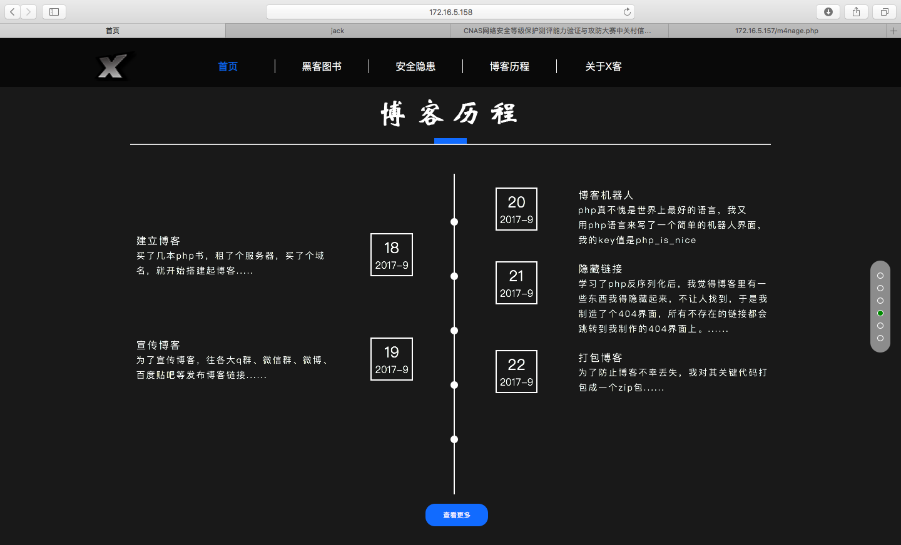

# CNAS/MPS CTF 2017: Remaining Information Protection 

**Points:** 300

> 一个博客的管理员，在服务器网站目录下备份了网站文件，你告诉他这样不好，他说没事，然后你用行动告诉他这样真的不好

> [www.zip](www.zip)  

## Write-up

比较有趣，首先是源码泄漏，从www.zip拿到了三个文件，function.php, 404.php和404.html。

看404.php，有个`unserialize($_POST["power"])`，应该是反序列化漏洞。再看function.php，里面有个类，有`__wakeup`魔术方法，首先检查成员变量`key`是否等于一个全局变量`$xkey`，这个全局变量是未知的，然而其实在它静态页面中存在，需要去找。然后其`cmd`成员变量在经过一个`waf`过滤了`cat`和空格之后会对成员变量`cmd`调用`system`函数。

反序列化是小问题，主要是绕过空格这个waf。首先`ls`出目录下的文件，有个flag.php，显然是查看这个文件。`cat`被过滤，有`tac`可以做到类似的操作（除了翻转输出），空格被过滤，用`<`将flag.php文件内容作为`tac`的stdin即可绕过。

## Other write-ups and resources

* <https://ctf-team.vulnhub.com/>
